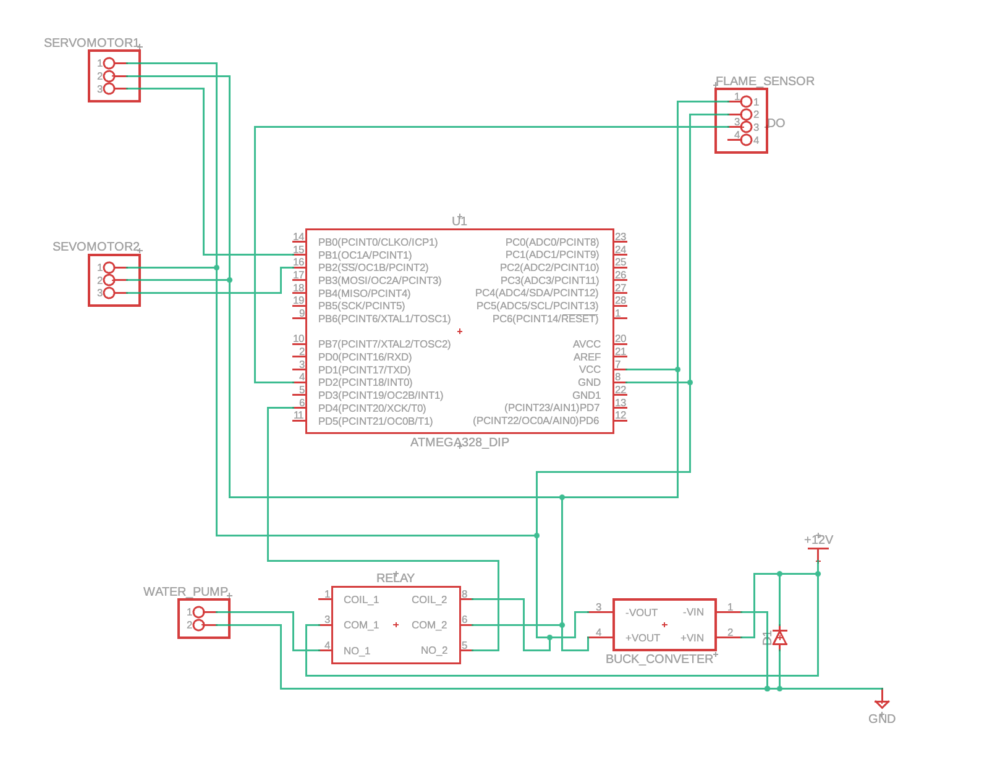

# Fire Detection and Suppression System

An active protection mechatronic system based on the **ATmega324PB** microcontroller. The system utilizes a periodic scanning algorithm to monitor a 180° sector, processing analog signals from an optical sensor to identify the infrared signature of a flame.

---

## 📝 General Description

The proposed system offers diverse applicability, primarily targeted at monitoring industrial environments with a high fire risk, where a rapid reaction is critical to limit damages before high-capacity sprinkler systems are activated. 

Due to the architecture of the ATmega324PB microcontroller, which provides dual USART, SPI, and TWI interfaces, the device can be easily integrated into redundant security systems, functioning as an independent node within a larger sensor network. 

From a technical and educational perspective, the project serves as an ideal case study for deepening the understanding of closed-loop control systems and managing hardware interrupts in real-time.

---

## 🛠️ Components

| Component | Type / Model | Role |
| :--- | :--- | :--- |
| **Microcontroller** | ATmega324PB Xplained Mini | Central Processing Unit (CPU); manages ADC and PWM signals. |
| **Flame Sensor** | Optical IR Sensor (Analog) | Detects infrared radiation emitted by a flame. |
| **Servo Motor 1** | SG90 / MG90 | Rotates the scanning assembly on the horizontal axis (180°). |
| **Servo Motor 2** | SG90 / MG90 | Controls the vertical orientation of the extinguishing nozzle. |
| **Mini Water Pump** | 3V - 6V DC | Delivers the extinguishing agent toward the fire. |
| **Relay Module** | 5V Optocoupled | Switches the pump on/off and isolates the power circuit from the MCU. |
| **Power Supply** | 5V / 2A (External) | Provides the necessary current for the motors and the pump. |
| **Connectivity** | Breadboard & Jumpers | Used for making electrical connections between modules. |

---

## 🔌 Electrical Schematic

### 💡 Design Explanations

* **Power Isolation:** The water pump is powered directly from the 12V rail via the relay. This prevents the high current draw and electrical noise of the motor from affecting the ATmega324PB's stability.
* **Voltage Regulation:** The LM2596 Buck Converter is tuned to exactly 5.0V. It powers the MCU and the servos, which require more current than a standard PC USB port can provide.
* **Safety Features:** * A flyback diode (D1) is placed at the input to prevent damage from reverse polarity.
  * The relay provides galvanic isolation between the water pump circuit and the microcontroller.
